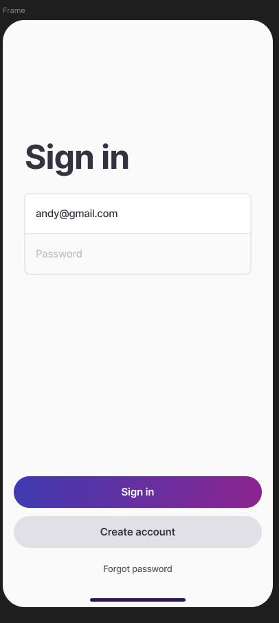
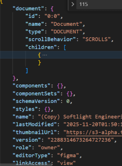
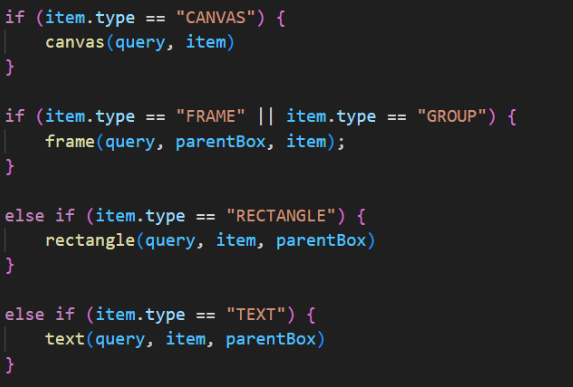
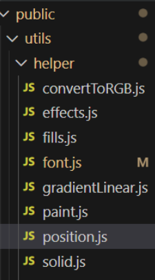

## Figma to HTML/CSS Converter
This project converts Figma Designs into its corresponding HTML/CSS visually accurate counterpart. This is done by taking any given Figma design by using Figma's REST API, and using that data to translate to HTML/CSS.

### The Figma Image:

### The CSS/HTML Converter Image:

## Tech Stack
* Node.js
* Express.js
* EJS
* Javascript
* Figma REST API

### Supported Features
The current types this project supports as writing this readme.file are:
* CANVAS
* FRAME
* RECTANGLE
* TEXT

### Supported Properties:
* Fills
* Strokes
* Positioning (absoluteBoundingBox)
* Paint object
* Gradient Linear

## Setup
### 1. Install Dependencies
`npm install`

### 2. Configure Environment Variables
Create a .env file in the root of the project and add the variable with its token value:

`TOKEN_KEY=<your_figma_token>`

### 3. Run the Server
In your terminal, run:

`node server.js`

This will run on localhost:3000
## How it Works
Keep in mind, my token has exceede its usage and I can't apply for new ones, so as regards to the server asking the user for the id, it's all done based on theory alone. I wasn't able to test. Because of this I also used fake mockData in order to mimic how an identical API call would send back data.
### Server

A server.js file in root which controls all routing and backend of the project. 

`getFigma:id` call which uses Figma API to retrieve data depending on the specific id used.

`/loadFigma` call which takes id from an input value that the user gave, and uses `getFigma:id` call in order to retrieve the data and render it to index.

### Creating Elements

`main.js` is the file that controls all the data processing. The data comes in, then translated and used.

The way this is done is by understanding that the figma file is a giant tree with a root parent called document:

The Document node has children (only certain types have children such as FRAMES, GROUPS and COMPONENTS) meaning we can search through all the children iteratively by level (BFS) or we can search through recursively by depth (DFS). I choose BFS because I felt like getting rid of the larger elements first would be better. 

The way BFS is used is through a queue where it pops the first node, creates a new div element of that node and processes it, then adds its children to the end of the queue. The reason why I needed the parent in each of the queue nodes is because the parent has properties important to the child such as positioning.

### Processing 

#### Types
In the processing stage, the way this is done is by taking the data, and searching to see which type it is. Most of the Figma node types have their own properties, which means the need to have unique functions as well. 

(all the type functions are located in public -> utils -> types)

Take rectangle for example as shown above. This type inherits all the properties of a vector with 3 additional ones.

In the function above, the function is looking for certain rectangle properties that it cares about in order to translate that over to css.

#### Helper Functions
Some properties are also very complex, so to make things less confusing, more dynamic, and easier to debug I created helper functions that can with the processing

An example of a helper function is the applyPosition function which applies the position on the x and y axis of each element.

## Limitations
